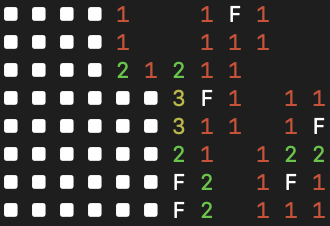

# pynesweeper

A minesweeper game in Python that runs in your terminal.



## Install

```console
pipx install pynesweeper
```

## Run

```console
pynesweeper --help
```

## Commands

Left click to detonate (or [chord](https://minesweepergame.com/strategy/efficiency.php)), right click to flag, good luck !
